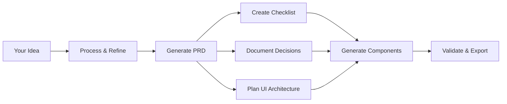

# Loadout

🚀 **AI-powered project blueprint generator** - Transform your ideas into complete React applications with comprehensive documentation, development roadmaps, and production-ready UI components.


## ✨ Overview

Loadout is a desktop application that uses advanced AI models to transform your project ideas into complete development blueprints. Simply describe what you want to build, and Loadout generates everything you need to start coding immediately.

### What You Get

- 📋 **Product Requirements Document (PRD)** - Detailed project specifications with goals, constraints, and success criteria
- ✅ **Development Checklist** - Phase-based implementation roadmap with actionable tasks
- 🧠 **Technical Decisions Log** - Documented assumptions and architectural choices
- 🎨 **Production-Ready UI** - Complete React/Tailwind components with live preview
- 💬 **AI Chat Assistant** - Refine and iterate on your generated components
- 📦 **Export Everything** - Download your complete project as organized files

## 🎯 Key Features

### Multi-Provider AI Support
- **OpenAI** - GPT-4, GPT-4 Turbo, GPT-3.5 Turbo
- **Anthropic** - Claude 3.5 Sonnet, Claude 3 Opus/Sonnet/Haiku  
- **Ollama** - Run models locally with no API key required

### Advanced Capabilities
- **LangGraph Workflow** - Sophisticated AI orchestration for consistent outputs
- **Streaming Responses** - Real-time generation with progress tracking
- **Live UI Preview** - Instant component rendering with hot reload
- **Chat Interface** - Iterate on your UI with conversational AI
- **Project Management** - Save, organize, and revisit all your ideas
- **Dark/Light Theme** - Beautiful UI that's easy on the eyes

## 🚀 Quick Start

### Prerequisites

- Node.js 18+ and npm
- At least one AI provider:
  - OpenAI API key (for GPT models)
  - Anthropic API key (for Claude models)  
  - Ollama installed locally (for free local models)

### Installation

```bash
# Clone the repository
git clone https://github.com/NoaheCampbell/loadout.git
cd loadout

# Install dependencies
npm install

# Start the application
npm run dev
```

### First Run

1. Click the settings icon to configure your AI provider
2. Enter your API key (or select Ollama for local models)
3. Create a new project and describe your idea
4. Watch as Loadout generates your complete blueprint!

## 📖 How It Works

### The LangGraph Workflow



Each step is powered by specialized AI agents that build upon previous outputs, ensuring consistency and completeness across all generated artifacts.

### Workflow Visualization

Click the "Workflow" button in the header to see a detailed, interactive diagram of how Loadout processes your ideas. The visualization includes:
- Real-time progress tracking during generation
- Validation steps for each phase
- Parallel processing indicators
- Provider-specific features

## 🏗️ Project Structure

Your generated projects include:

```
your-project/
├── PRD.md                    # Product requirements document
├── CHECKLIST.md             # Development roadmap
├── DECISIONS.md             # Technical decisions log
├── src/
│   ├── App.tsx             # Main application component
│   ├── components/         # Generated UI components
│   ├── _setup.js          # Project setup instructions
│   └── index.html         # Preview HTML file
└── project.json            # Project metadata
```

## 📁 Storage Locations

Projects are stored locally on your machine:

- **macOS**: `~/Library/Application Support/Loadout/projects/`
- **Windows**: `%APPDATA%/Loadout/projects/`
- **Linux**: `~/.config/Loadout/projects/`

## 🛠️ Development

```bash
# Run in development mode
npm run dev

# Build for production
npm run build

# Package for distribution
npm run dist

# Run tests
npm test

# Type checking
npm run typecheck
```

## 🔧 Configuration

### AI Providers

Configure your preferred AI provider in Settings:

1. **OpenAI** - Best for general-purpose generation
2. **Anthropic** - Excellent for complex reasoning
3. **Ollama** - Free local models, no internet required

### Ollama Setup

```bash
# Install Ollama
curl -fsSL https://ollama.com/install.sh | sh

# Pull a model
ollama pull llama2

# Loadout will auto-detect available models
```

## 🎨 Features in Detail

### Chat Interface
- Stream responses in real-time
- Maintain context across conversations
- Regenerate specific components
- Export chat history with projects

### UI Generation
- Multi-file component generation
- Automatic import resolution
- Tailwind CSS integration
- Responsive design patterns
- Accessibility considerations

### Export Options
- Complete project ZIP file
- Individual file downloads
- Copy-to-clipboard for quick sharing
- Direct integration with code editors

## 🤝 Contributing

We welcome contributions! Please see our [Contributing Guide](CONTRIBUTING.md) for details.

### Development Setup

1. Fork the repository
2. Create your feature branch (`git checkout -b feature/amazing-feature`)
3. Commit your changes (`git commit -m 'Add amazing feature'`)
4. Push to the branch (`git push origin feature/amazing-feature`)
5. Open a Pull Request

## 📄 License

This project is licensed under the MIT License - see the [LICENSE](LICENSE) file for details.

## 🙏 Acknowledgments

Built with amazing technologies:

- [Electron](https://www.electronjs.org/) - Cross-platform desktop framework
- [React](https://react.dev/) - UI library
- [LangGraph](https://github.com/langchain-ai/langgraph) - AI workflow orchestration
- [Tailwind CSS](https://tailwindcss.com/) - Utility-first CSS framework
- [Monaco Editor](https://microsoft.github.io/monaco-editor/) - Code editor
- [Zustand](https://zustand-demo.pmnd.rs/) - State management

## 🐛 Troubleshooting

### Common Issues

**API Key Not Working**
- Ensure your API key has the necessary permissions
- Check your billing/usage limits
- Verify the key is correctly entered in Settings

**Ollama Connection Failed**
- Make sure Ollama is running (`ollama serve`)
- Check if models are downloaded (`ollama list`)
- Verify Ollama is accessible at `http://localhost:11434`

**Generation Errors**
- Try a different AI model
- Simplify your project description
- Check the console for detailed error messages

## 📞 Support

- 📧 Email: support@loadout.app
- 💬 Discord: [Join our community](https://discord.gg/loadout)
- 🐛 Issues: [GitHub Issues](https://github.com/yourusername/loadout/issues)

---

<p align="center">Made with ❤️ by developers, for developers</p>
<p align="center">Transform your ideas into reality with Loadout</p>
